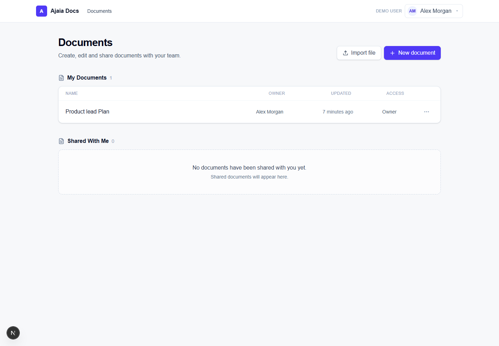

# Ajaia Docs

Ajaia Docs is a focused collaborative document editor built for a time-boxed product-engineering assignment. It combines a polished TipTap writing experience with persistent PostgreSQL storage, file import, demo-user switching, sharing, and server-enforced access control.

## Live Demo

Deployment is pending because this environment does not have a Vercel account/session or production PostgreSQL credentials. The source repository is available at [github.com/RaoUsama7/Ajaia-Docs](https://github.com/RaoUsama7/Ajaia-Docs), and the local preview runs at [http://localhost:3000/documents](http://localhost:3000/documents).

After deployment, replace this section with the Vercel URL.



## Demo Accounts

- Alex Morgan — alex@ajaia.demo
- Jordan Lee — jordan@ajaia.demo
- Taylor Kim — taylor@ajaia.demo

No password is required. Use the clearly labeled **Demo User** selector in the application header. The selected identity is stored in an HTTP-only cookie and validated against the seeded users on the server.

## Features

- Create, reopen, rename, and delete owned documents
- TipTap rich text editing with headings, emphasis, lists, and history controls
- Debounced, serialized autosaving of structured TipTap JSON
- Import `.txt` and `.md` files up to 1 MB
- Share documents with another seeded user as an editor
- Clear **My Documents** and **Shared With Me** sections
- Owner-only sharing, renaming, and deletion
- Server-side authorization and Zod validation for every mutation
- Friendly loading, empty, setup, and error states
- Focused automated tests for permissions and validation

## Tech Stack

- Next.js 16 App Router, React 19, and strict TypeScript
- Tailwind CSS 4
- TipTap 3
- Prisma 6 and PostgreSQL (Neon or Supabase compatible)
- Zod 4
- Vitest 4
- `marked` with TipTap's server HTML converter for Markdown imports

## Local Setup

Requirements: Node.js 20.9+ and a PostgreSQL database.

```bash
npm install
copy .env.example .env
```

Set `DATABASE_URL` in `.env`, then run:

```bash
npx prisma migrate deploy
npm run db:seed
npm run dev
```

Open [http://localhost:3000](http://localhost:3000). For schema iteration during development, use `npm run db:migrate` instead of `prisma migrate deploy`.

### Local preview without PostgreSQL

When `NODE_ENV` is not `production` and `DATABASE_URL` is missing or still contains the example placeholder, the preview automatically uses a small file-backed adapter. It creates `.local/ajaia-data.json` with the three demo users and persists documents and shares there, so the full create/edit/share/switch-user flow can be reviewed without an external database. This adapter is development-only and is never selected in production or on Vercel. To use PostgreSQL locally, set a real `DATABASE_URL`; the Prisma path is selected automatically.

## Testing

```bash
npm run test
npm run lint
npm run build
```

## Supported Imports

- Plain text: `.txt`
- Markdown: `.md` (headings, paragraphs, lists, bold, and italic are preserved)
- Maximum size: 1 MB

Raw HTML embedded in Markdown is treated as text rather than trusted markup.

## Sharing Demo

1. Select Alex Morgan.
2. Create a document and enter content.
3. Open **Share** and add Jordan Lee.
4. Switch to Jordan in the header.
5. Open the document under **Shared With Me**.
6. Edit the content and wait for **Saved**.
7. Switch back to Alex and reopen the document to see Jordan's changes.

Taylor cannot open the document until Alex explicitly shares it. Jordan can edit shared content but cannot rename, delete, or manage sharing.

## Architecture

The application uses one Next.js deployment for the client and server boundary. Server actions validate inputs, resolve the selected demo user, and enforce ownership/sharing before Prisma queries mutate data. TipTap JSON is the canonical document format. See [ARCHITECTURE.md](./ARCHITECTURE.md) for details.

## Source Structure

```text
src/app/                 App Router pages and server actions
src/components/          Dashboard, import, editor, toolbar, sharing UI
src/lib/                 Auth, persistence selection, validation, permissions
prisma/                  PostgreSQL schema, migration, and seed script
docs/                    Reviewer screenshot
```

## Intentional Scope Decisions

- Seeded demo-user switching replaces production authentication.
- Editing is sequential and persisted, not simultaneous real-time collaboration.
- CRDTs, live cursors, comments, notifications, and version history are excluded.
- Import is deliberately limited to `.txt` and `.md`; DOCX parsing is excluded.
- A single `EDITOR` sharing role keeps the ownership model obvious.

These choices protect the 4–6 hour scope and concentrate effort on the complete reviewer journey: write, persist, share, switch identity, authorize, and edit.

## Deployment

1. Create a Neon or Supabase PostgreSQL database.
2. Add `DATABASE_URL` to the Vercel project environment variables.
3. Run `npx prisma migrate deploy` and `npm run db:seed` against that database.
4. Import this repository into Vercel and deploy. The build script generates Prisma Client before the Next.js production build.
5. Replace the placeholder URLs in this README and `SUBMISSION.md`.

## Future Improvements

- Production identity and workspace membership
- Yjs/Liveblocks-based simultaneous editing
- Document versions and recovery
- Anchored comments and mentions
- Activity logs, monitoring, and rate limiting
- Object storage and richer import/export formats
